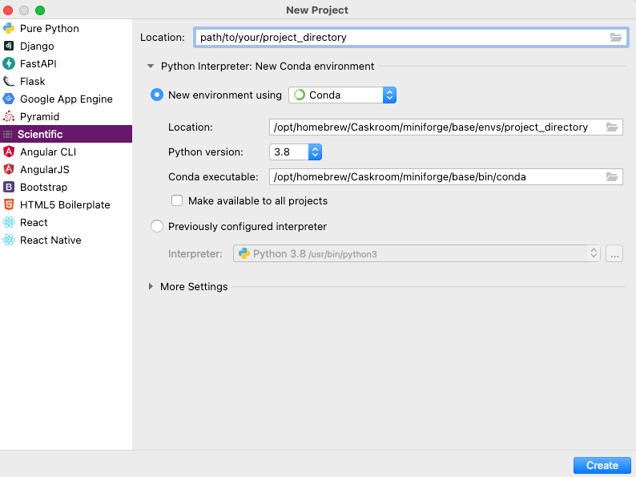
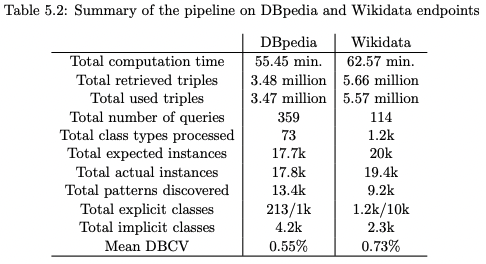
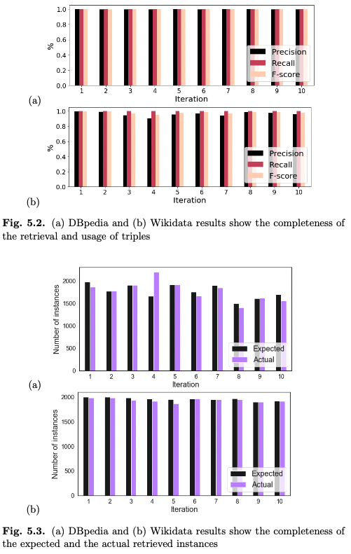
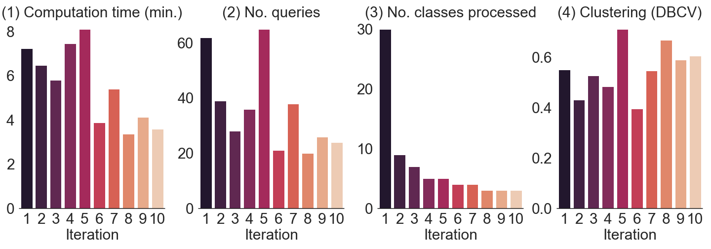
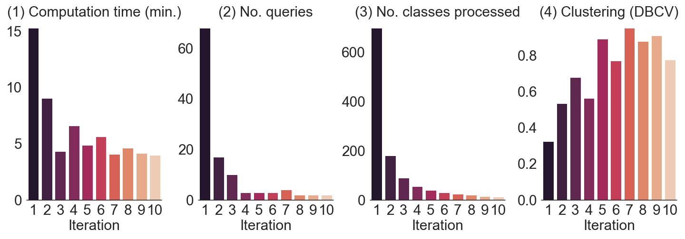
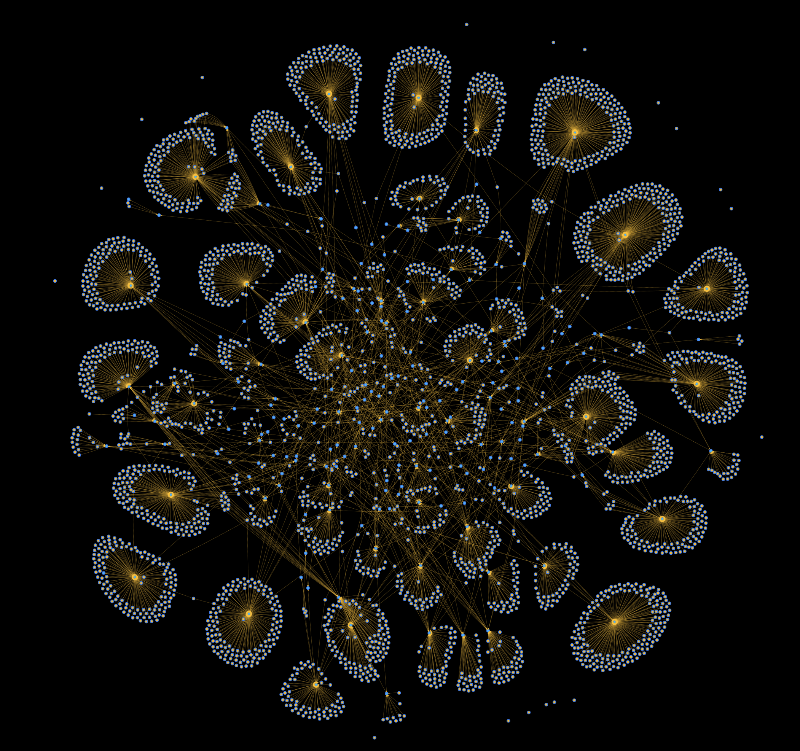

<h1 align="center">Master's Thesis Applied Data Science</h1>
Department of Information and Computing Sciences

Utrecht University | Universiteit Utrecht

<br/>

<h1 align="center">Partial RDF Schema Retrieval</h1>

### Author
Koray Poyraz

### First supervisor
Dr. M. (Michael) Behrisch

### Second supervisor
Prof. dr. ir. A.C. (Alex) Telea

### Abstract
There are various data structures that represent data interrelationships in the universe of information. One is a graph-based data structure, which depicts a collection of entities connected by relationships. Resource Description Framework (RDF) is a widely used data model that facilitates the storage of graph-based data. This system, unlike standardised SQL, lacks a consistent schema that evolves over time. When presenting a complete schema is crucial, the loose standards combined with timeout limits in the retrieval process pose a challenge. The objective of this master's thesis is therefore to develop a partial schema retrieval pipeline in order to solve the previously outlined problem. We evaluate the quality of our approach by measuring performance and completeness. This is conducted by running the pipeline against several SPARQL-endpoints. The pipeline lays the foundation for retrieving partial graph schemas per iteration. The result is a rendered set of visualisations of partial schemas displayed in a hierarchical aggregated view. This should provide the ability to iteratively express portion of a graph, regardless of the evolving schema.

<br/>


<br/>
<h1 align="center">Setup</h1>

## Prerequisite
- Python 3.8
  - https://www.python.org/downloads/
- Miniforge for Conda (optional)
  - https://github.com/conda-forge/miniforge
- Virtual Environment (optional)
  - https://packaging.python.org/en/latest/guides/installing-using-pip-and-virtual-environments/
- IDE (e.g. PyCharm Professional)
  - https://www.jetbrains.com/pycharm

## How I did it
1. install PyCharm Professional
2. install Miniforge to isolate the libraries so it does not effect your general package manager
3. create a 'scientific' project selecting Conda as package manager and Python 3.8



## Installation guide for this project
### (1) install jupyter notebook
Open a terminal from the directory of the project and enter the following command:
```sh
pip install -r requirements.txt
```
### (2) install required libraries
```sh
Run the code cell called 'Installer of the required libraries
' in apv6.ipynb notebook file
```

## Reproducing
For reproducing you run the code cells (with shift-enter) in apv6.ipynb notebook file

## Data dump
We created several data dump files containing nodes (partial schemas) obtained after 10 iterations. They are stored in two dump files. One for DBpedia and the other for Wikidata. 
### File path of the dump files
The dump files along with the measurements over 10 iterations can be found in the directory called "data".
- dump files
  - data/dbpedia_1_10_55min_nodes_dump.json
  - data/wikidata_1_10_1h2min_nodes_dump.json
- measurement files
  - data/dbpedia_batch_1_10_55min_213_explicit_4168_implicit_stats.csv
  - data/wikidata_batch_1_10_1h2min_1161_explicit_2286_implicit_stats.csv
### Data structure of the dump file
The dump file is in JSON format. It is an Array of elements. Each element represents a Node structure and each Node represents two sets of Edge structure as incoming and outgoing edges.
- Node structure
  - id = (String | Int) = represents a Unique id of the node expressed as Class name (explicit class) or Hash. 
    - E.g. 'Person' as explicit class and 4698942821820227975 as implicit class.
  - label = (String) = represents an implicit or explicit class name. 
    - E.g. 'Person' as explicit class and 'P0-C0' as implicit class. P denotes ith iteration and C denotes ith node.
  - class type = (String) = represents the type of the class, so whether it is an implicit or explicit class
  - class overlaps = Array(String) = represents the class overlaps found within the distribution of similar patterns
  - properties = Array(String) = represents the attributes
  - out_edge = Array(Edge) = represents an Array of outgoing edges
  - in_edge = Array(Edge) = represents an Array of incoming edges
- Edge structure
  - id = (String) = Unique id of the edge 
    - e.g. 'P0-C0XauthorOf-Out', 'P0-C0XsubClassOf' etc..
  - label = (String) = represents the edge label
    - e.g. 'authorOf', 'subClassOf' etc..
  - to_node = (String) = represents 
    - one, the predicate annotated as 'In' or 'Out' for **semantic linking** 
      - e.g. 'authorOf-Out'
    - two, a node id of an explicit class for **hierarchical linking** 
      - e.g. 'Person'

## Experiment on DBpedia and Wikidata

### Total summary of 10 iterations


### Completeness


### Performance



### Visualization of DBpedia and Wikidata
A graphical representation after 10 iterations. Note, blue color represents the explicit classes and yellow color the implicit classes.

<br/>
- DBpedia
<br/>


<br/>
<br/>
- Wikidata
<br/>
